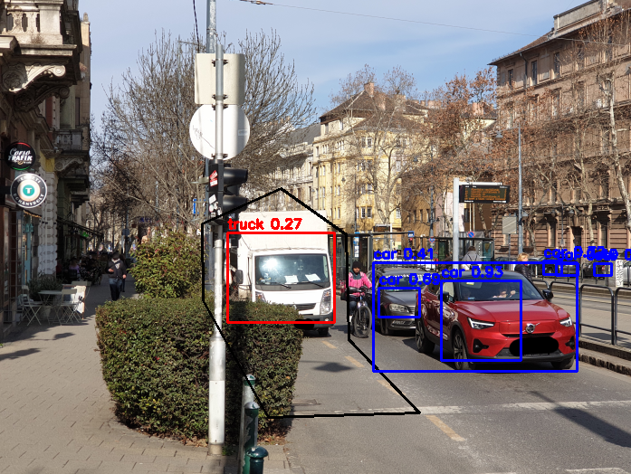

# CarDetectionDemo
I show how to detect cars which are parking in a bad place (cycle lane) with yolo3-tiny. With this small model you can detect cars with Raspberry Pi, or low power computer, and make warnings for drivers.

I downloaded .cfg, .weights, and the names from here: https://github.com/smarthomefans/darknet-test/tree/master

Some example before detection:

After processing (within black line it is frobidden for a car to be, (cycle lane)

